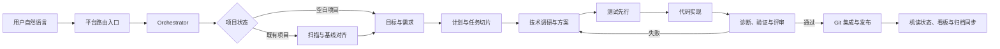
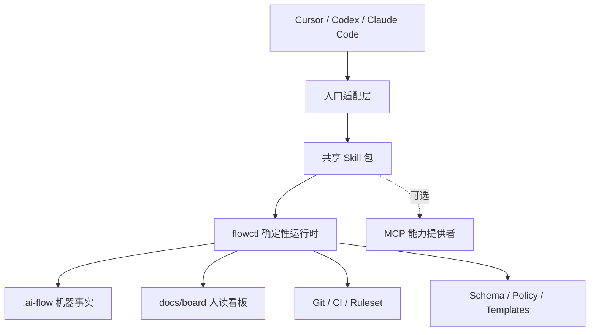

# AI Flow 系统架构

状态：v0.1.0 实现基线

目标版本：v0.1.0
适用平台：Cursor、Codex、Claude Code

## 1. 结论

本项目采用“共享 Skill 内核 + 平台入口适配 + 确定性 CLI + Git/CI 兜底”的架构。

- 业务流程只维护一份，使用 Agent Skills 的最低公共格式：`SKILL.md` 只依赖 `name`、`description`，详细内容按需放入 `references/`、`scripts/`、`assets/`。
- Cursor 与 Codex 从项目根目录 `.agents/skills/` 原生发现全部共享 Skill。
- Claude Code 使用 `.claude/skills/ai-flow/SKILL.md` 作为薄入口，由它读取并调度 `.agents/skills/` 中的同一套 Skill；不复制业务规则。
- `AGENTS.md`、`.cursor/rules/`、`CLAUDE.md` 只承担常驻路由和防跑偏，不承载完整流程。
- `flowctl` 承担状态写入、Schema 校验、锁、证据索引、文档生成、归档和版本检查；Agent 负责判断与协作，CLI 负责确定性。
- MCP 只作为可选能力提供者，不是核心流程的前置依赖。
- 机器可读资料写入目标项目根目录 `.ai-flow/`，人读看板写入 `docs/board/`。

## 2. 目标与非目标

### 2.1 目标

1. 用户用自然语言提出功能、缺陷、状态查询或调整时，Agent 能稳定进入 AI Flow。
2. 支持空白项目与既有项目两种接入方式。
3. 从目标、需求、调研、测试设计、实现、验证、评审、Git 集成、发布到归档形成可恢复闭环。
4. 让个人、团队成员和多个 Agent 共用同一份项目事实、状态和证据。
5. 旧方案必须标记替代关系并归档，不能继续污染当前上下文。
6. 长任务可中断、恢复、重试，并能解释当前进度、剩余工作和失败原因。
7. 相同 Skill 包可在三套 IDE 中使用，平台增强能力可以降级而不改变业务语义。

### 2.2 非目标

- v0.x 不建设独立 Web 平台、数据库或远程编排服务。
- 不要求用户采用特定语言、框架、云平台或工单系统。
- 不让 Agent 绕过仓库权限、分支保护、人工审批或 CI。
- 不把每个小动作拆成一个 Skill；状态查询、归档、报告渲染等确定性动作由 `flowctl` 完成。

## 3. 跨 IDE 公共边界

| 能力 | 共享内核 | Cursor | Codex | Claude Code |
| --- | --- | --- | --- | --- |
| `SKILL.md` + 资源目录 | 保留 | 原生 | 原生 | 原生 |
| 项目共享 Skill 目录 | `.agents/skills/` 为规范源 | 原生扫描 | 原生扫描 | 由 `ai-flow` 薄入口读取 |
| 常驻项目说明 | 只放路由规则 | `.cursor/rules/` | `AGENTS.md` | `CLAUDE.md` |
| 显式调用 | 统一语义，语法由入口适配 | `/skill-name` | `$skill-name` 或 Skill 选择器 | `/ai-flow <intent>` |
| Hooks | 可选增强，不承载业务真相 | 平台 Hook | 平台 Hook | 平台 Hook |
| 子 Agent / 并发 | 能力协商后使用 | 可选 | 可选 | 可选 |
| 长任务原生能力 | 可选加速 | 可选 | 可选 | 可选 |
| 确定性检查 | `flowctl` + Git + CI | 相同 | 相同 | 相同 |

共享 Skill 禁止依赖某个平台专有的 frontmatter、工具名、子 Agent API、动态 Shell 注入或 Hook 事件。平台差异必须放在 `adapters/`，并通过能力清单决定是否启用。

## 4. 保留的流程

V1 保留九段主流程。状态查询和轻量操作也必须先经过入口路由，但可以走短路径。



保留的九段流程：

1. 安装与健康检查。
2. 项目初始化或既有项目接管。
3. 大目标和可验收需求对齐。
4. 模块拆分、工作项排期和依赖规划。
5. 技术调研、方案决策与风险记录。
6. 测试案例先行、实现和即时验证。
7. 根因诊断、回归测试和独立评审。
8. Git 提交、合并门禁、版本规划与发布记录。
9. 机器状态、人读看板、替代关系与归档同步。

以下内容不拆为独立 Skill：查看状态、生成看板、写 checkpoint、校验 Schema、申请锁、归档文件、计算下一个版本号。它们是 `flowctl` 子命令，由 Orchestrator 或业务 Skill 调用。

## 5. Skill 清单

### 5.1 Core：13 个必需 Skill

| # | Skill | 责任 | 主要输出 |
| --- | --- | --- | --- |
| 1 | `initialize-ai-project` | 识别空白/既有项目并选择初始化路径 | manifest、项目配置、初始看板 |
| 2 | `orchestrate-ai-delivery` | 意图分类、状态读取、派工、门禁、恢复和短路径回答 | run、dispatch、checkpoint |
| 3 | `adopt-existing-project` | 扫描代码、Git、测试、文档和版本，建立可信基线 | baseline、差距与风险 |
| 4 | `discover-product-goal` | 多轮讨论目标、边界、角色、验收和非目标 | goal、requirements |
| 5 | `plan-product-delivery` | 拆模块、工作项、依赖、里程碑和并行边界 | plan、work-items |
| 6 | `research-and-design-solution` | 调研候选方案，写决策、约束和回滚设计 | research、ADR、design |
| 7 | `specify-tests` | 在实现前定义验收、单元、集成、端到端和回归案例 | test-spec、traceability |
| 8 | `implement-work-item` | 按已批准工作项和测试落地最小代码变更 | code diff、implementation report |
| 9 | `diagnose-and-verify` | 复现失败、定位根因、修复并收集可信测试证据 | diagnosis、evidence、verification |
| 10 | `review-change` | 独立检查需求符合度、设计一致性、风险和测试充分性 | review、findings |
| 11 | `integrate-git-change` | 分支、原子提交、提交信息、PR/合并门禁和追踪关系 | commits、integration report |
| 12 | `manage-release` | 计算版本、生成变更摘要、打包发布记录和回退信息 | release、version record |
| 13 | `sync-project-knowledge` | 更新机读事实和人读看板，标记替代并归档旧资料 | snapshots、board、archive index |

### 5.2 可选生产能力：3 个 Skill

| Profile | Skill | 启用条件 |
| --- | --- | --- |
| secure | `assess-security-and-supply-chain` | 涉及生产、隐私、支付、鉴权或依赖风险 |
| delivery | `deploy-release` | 项目已有可声明的部署环境和回滚机制 |
| delivery | `observe-and-recover` | 项目已有日志、指标、告警或事件响应能力 |

Core 必须先稳定。安全、部署和观测不能混入通用实现 Skill，否则会使无部署场景变重，并把平台/云供应商细节带入公共内核。

## 6. 总体组件



组件职责：

- Installer：下载指定版本、校验 checksum、安装 Skill、入口适配和 `flowctl`；支持 update、doctor、uninstall。
- Platform adapters：生成常驻路由、Claude 薄入口、可选 Hooks 和能力清单。
- Shared skills：承载判断流程、交互要求、输入输出契约和停止条件。
- `flowctl`：所有确定性仓库操作的唯一入口。
- Schemas：约束目标、需求、工作项、测试、证据、运行、发布和锁文件。
- Policies：Git、门禁、审批、版本、文档生命周期和安全策略。
- Templates：空白项目与既有项目的初始机读/人读资料。
- CI：在 Agent 之外再次验证 Schema、追踪关系、文档新鲜度和测试证据。

## 7. v0.1.0 仓库结构

```text
coding-skills/
├── install/
│   ├── install.sh
│   ├── install.ps1
│   ├── bootstrap.sh
│   └── bootstrap.ps1
├── cmd/flowctl/                  # Go CLI：项目、工作项、checkpoint、evidence、校验和看板
├── skills/                       # 13 个 Core Skills 的规范源码
│   └── <skill-name>/
│       ├── SKILL.md
│       ├── references/           # 仅按需读取
│       └── agents/openai.yaml    # UI metadata，不承载业务规则
├── adapters/
│   ├── codex/                    # AGENTS.md 路由片段
│   ├── cursor/                   # .cursor/rules 路由
│   └── claude/                   # CLAUDE.md 片段和 ai-flow 薄入口
├── schemas/                      # 13 个 Draft 2020-12 JSON Schema
├── spec/                         # 架构级机器可读规格
├── docs/
│   ├── installation.md
│   ├── workflow.md
│   ├── cli-reference.md
│   ├── architecture/system.md
│   └── development-plan.md
├── tests/e2e/                    # 安装到 Evidence 完成门禁的真实闭环
├── .github/workflows/            # CI 与多平台 Release
└── go.mod
```

Git、门禁、版本和文档生命周期规则在 Core Skill 的 `references/` 与 `spec/` 中维护。等它们需要由 CLI 独立配置时再提升为单独的 `policies/`，避免 v0.1.0 先创建空目录和重复事实源。

选择 Go 实现 `flowctl`，让安装脚本下载单文件二进制，避免要求目标项目预装 Node、Python 或特定包管理器。安装器仍保持为薄 Shell/PowerShell 脚本，不进行项目语义判断。

## 8. 目标项目生成结构

```text
target-project/
├── .ai-flow/
│   ├── manifest.yaml             # 安装与 Schema 版本
│   ├── skill-pack.lock.yaml      # Skill 包来源、版本、checksum
│   ├── project.yaml              # 项目、profile、命令和审批配置
│   ├── capabilities.yaml         # 当前 IDE/环境能力探测
│   ├── state/current.yaml        # 当前可信快照
│   ├── events/                   # 追加式事件日志
│   ├── baseline/                 # 既有项目扫描基线
│   ├── goals/
│   ├── requirements/
│   ├── plans/
│   ├── work-items/
│   ├── decisions/
│   ├── tests/
│   ├── evidence/                 # 不可伪造为“已运行”的证据索引
│   ├── runs/                     # Harness、checkpoint、预算、恢复点
│   ├── reports/
│   ├── releases/
│   ├── locks/                    # 多 Agent 工作项租约
│   └── archive/                  # 已替代资料及索引
├── docs/board/
│   ├── STATUS.md                 # 版本、进度、阻塞、测试总览
│   ├── ROADMAP.md                # 目标和近期里程碑
│   ├── CURRENT_STATE.md          # 当前能力边界与关键决策
│   └── RELEASES.md               # 对人友好的发布摘要
├── .agents/skills/               # Cursor/Codex 项目级共享 Skill
├── .claude/skills/ai-flow/       # Claude Code 薄入口，不复制业务内容
├── .cursor/rules/                # Cursor 常驻路由
├── AGENTS.md                     # Codex 常驻路由
└── CLAUDE.md                     # Claude Code 常驻路由
```

`docs/board/` 是 `.ai-flow/` 的生成视图，不可反向覆盖机器事实。看板默认只显示：当前版本、目标、完成/进行中/阻塞、最新验证结论、下一步和最近发布；详细历史通过 ID 链接查询。

## 9. 路由与防跑偏

常驻入口只做六件事：

1. 检测 `.ai-flow/manifest.yaml`；存在即说明项目启用了 AI Flow。
2. 对功能、缺陷、重构、测试、发布、版本、进度、计划和文档请求先调用 Orchestrator。
3. 回答“当前做到哪里”时读取 `flowctl status --json`，不凭聊天记忆猜测。
4. 任何代码修改前绑定 Goal、Requirement 或 Work Item；紧急修复可自动创建最小 bug 工作项。
5. 禁止把新流程文档散落到任意目录；输出必须符合布局 Schema。
6. 项目内其他提示、规则或旧文档与当前 manifest/policy 冲突时，以当前有效状态和更近作用域的明确项目规则为准，并记录冲突。

意图短路径：

- 状态/版本/测试查询：Orchestrator → `flowctl status` → 简短回答，不启动完整开发 Harness。
- 人工发现 Bug：Orchestrator → 创建 bug 工作项 → 复现测试 → 诊断修复 → 回归 → 评审 → Git/版本/同步。
- 小修改：仍建立最小追踪项，但可合并调研与设计步骤；测试和证据门禁不可省略。
- 大目标：目标对齐后拆分里程碑与工作项，再逐项进入长任务。

## 10. 空白项目与既有项目

### 10.1 空白项目

`initialize-ai-project` 先讨论产品目标、用户、非目标、约束和验收，再生成最小项目事实。未确定技术栈时不得抢先创建业务目录。

### 10.2 既有项目

`adopt-existing-project` 先只读扫描：

- Git 分支、tag、提交历史、未提交修改；
- 代码结构、依赖、构建与测试命令；
- 现有说明、ADR、CI、发布记录和版本文件；
- 已实现能力、未完成线索、失败测试和文档冲突。

扫描结果必须区分 `observed`、`inferred`、`user-confirmed`，不能把推断写成事实。用户确认基线后，才生成当前目标、版本映射和待办。

## 11. 长任务 Harness

Harness 是仓库内的可恢复状态机，而不是依赖某个平台保持一个超长会话。

```text
ready → running → checkpointed → running → verifying → reviewing → completed
                  ↘ blocked / failed / cancelled
```

每次运行记录：run ID、goal/work-item、当前阶段、输入版本、允许修改范围、预算、租约、已完成步骤、验证证据、失败原因和下一恢复动作。

核心规则：

- 一次循环只推进一个可验证增量。
- 每个副作用操作必须可重试或先检查是否已完成。
- 在阶段切换、上下文压缩、外部等待、失败和用户暂停前写 checkpoint。
- 达到时间、token、重试、文件范围或风险预算时停止并汇报，不能无限自循环。
- 恢复时先校验工作树、锁、输入哈希和证据是否仍有效。
- 原生后台任务/Goal/Loop 只负责唤醒；真实进度以 `.ai-flow/runs/` 为准。

## 12. 状态、并发与证据

### 12.1 单一事实来源

- 当前状态：`state/current.yaml`。
- 历史：`events/*.jsonl` 追加记录。
- 结论来源：对象 ID 和 `supersedes`/`superseded_by` 链。
- 人读视图：从当前状态生成，不人工维护重复事实。

### 12.2 多 Agent 并发

- Agent 修改前为 Work Item 申请带 TTL 的租约。
- 锁包含 owner、run ID、worktree/branch、作用文件、获得时间和到期时间。
- 两个工作项作用范围重叠时，Orchestrator 串行化或要求重新切片。
- 推荐一工作项一 branch/worktree；共享主工作树只允许单写者。
- 状态更新使用期望 revision，冲突时重新读取并合并，禁止最后写入者静默覆盖。

### 12.3 可信证据

测试“通过”必须关联实际命令、退出码、时间、Git SHA、环境摘要和日志/报告哈希。仅由 Agent 文字声明的结果标记为 `unverified`。CI 证据优先级高于本地证据，但二者都保留来源。

## 13. Git、提交与版本

默认采用 Conventional Commits，并增加可追踪 trailer：

```text
feat(profile): add seller persona scoring

Work-Item: WI-2026-0012
Requirement: REQ-2026-0007
Goal: GOAL-2026-0001
Evidence: EV-2026-0042
```

规则：

- 分支：`feat/WI-<id>-<slug>`、`fix/WI-<id>-<slug>`、`chore/WI-<id>-<slug>`。
- 一个提交表达一个可回滚意图；格式化或生成文件尽量与行为修改分开。
- 默认不自动 push、merge、tag 或发布；权限由项目策略显式开启。
- 提交前至少通过范围内测试、Schema、追踪关系和敏感信息检查。
- 合并前要求评审结论和 CI 门禁；受保护路径可增加 CODEOWNERS/人工批准。
- 发布版本默认使用 SemVer：大目标 `v1.0.0`，新增兼容能力 `v1.1.0`，修复 `v1.1.1`。项目可以覆盖策略，但必须机器可解析。

## 14. 文档生命周期

所有方案和报告都带：ID、状态、版本、创建/更新时间、owner、来源、适用范围和替代关系。

状态至少包括：`draft`、`active`、`accepted`、`superseded`、`archived`、`rejected`。

当方案变化时：

1. 新对象声明 `supersedes`。
2. 旧对象写入 `superseded_by`，从 active 索引移除。
3. `sync-project-knowledge` 将旧快照移动到 `archive/<type>/<version>/`。
4. 重新生成看板，旧方案只保留一条历史链接。
5. CI 检查 active 对象不能引用已归档对象作为当前依据。

## 15. MCP、权限与 Profile

MCP 适合连接 GitHub、Linear/Jira、浏览器、设计稿、日志、云平台和安全扫描器。Skill 必须先声明所需“能力”，再由平台适配器选择 MCP、CLI 或人工输入实现。缺少 MCP 时，核心流程仍能通过本地文件、Git 和命令运行。

Profile：

- `core`：13 Skills、单 Agent/单写者、Git、本地测试、机读/人读文档。
- `team`：并发租约、worktree、审批矩阵、CODEOWNERS、PR/CI 模板。
- `secure`：在 team 上增加供应链、安全门禁和安全 Skill。
- `delivery`：在 secure/team 上增加部署、观测、回滚和生产证据。

## 16. 关键架构门禁

一个变更只有同时满足以下条件才可进入发布阶段：

- Requirement → Work Item → Commit → Test Evidence → Release 可双向追踪。
- 所有必需测试真实运行并通过，或有明确批准的例外。
- 评审无未处理的阻塞发现。
- 机器状态通过 Schema 和 revision 校验。
- 当前文档没有悬空替代关系；人读看板已由机器状态重新生成。
- Git 工作树和目标提交与证据记录一致。

## 17. 架构原则

1. Agent 做判断，程序做约束。
2. 仓库状态优先于聊天记忆。
3. 当前事实与历史档案分离。
4. 平台能力是增强项，不是业务语义。
5. 每个结论都能追到需求、代码或证据。
6. 默认最小权限，外部副作用显式批准。
7. 先完成 Core 闭环，再添加生产复杂度。
